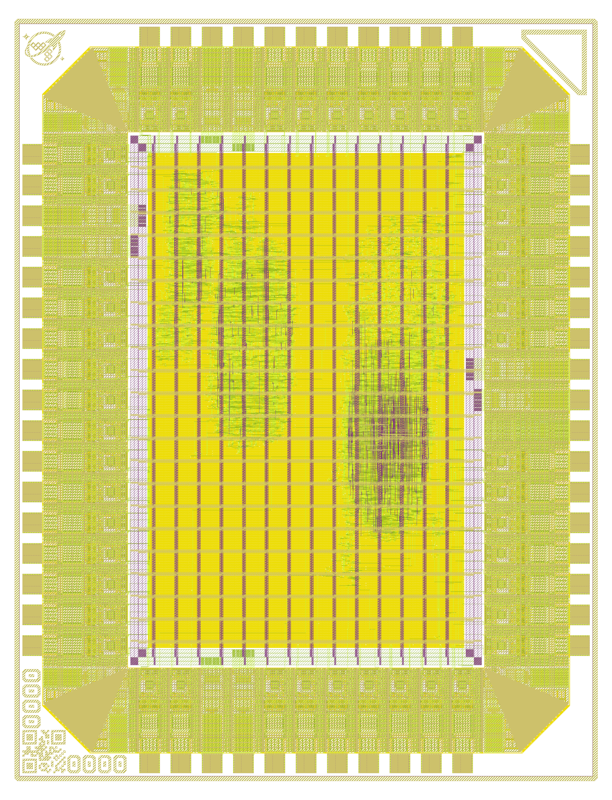
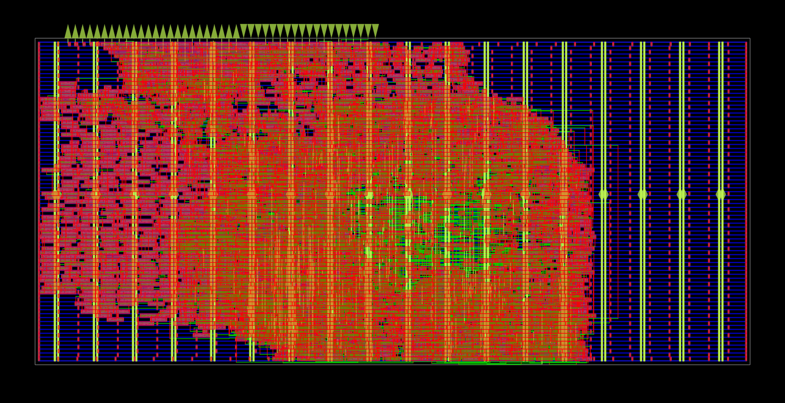
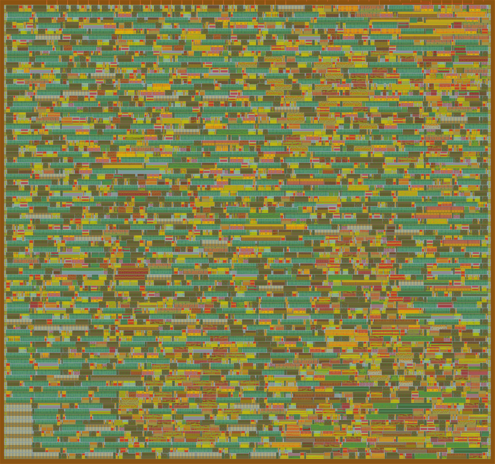
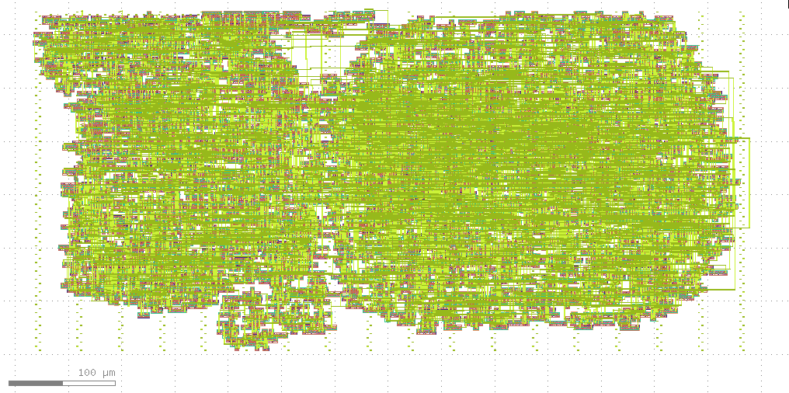

# Coffee-Shop Project

Coffee-shop is a project to build fully open source networking equipment, this includes 
both full open source ASIC chips as well as the accompanying PCB hardware. 

This is the central repository for linking to all sub-projects. 

## ASICs 

The project includes the following ASIC chips and libraries, all ASICs have 
already been taped-out at least once:
- [`expresso` first generation full switch chip.](https://github.com/Essenceia/Expresso_ASIC_Chip)
- [`coffeepot` first generation switch.](https://github.com/Essenceia/ethernet_switch_asic)
- [`teapot` Ethernet wrapper for building network connected accelerators.](https://github.com/Essenceia/Teapot)
- [`coldbrew` Ethernet connected beacon for broadcasting an ethernet frame with an uptime count until the heat death of the universe.](https://github.com/Essenceia/Until_Heat_Death_Do_Us_Part)

#### Expresso

 

#### Coffeepot

 

#### Teapot

 

#### Coldbrew

 

## PCBs 

PCB designs and manufacturing files for the hardware accompanying the ASICs:
- [`biscotti` x1 port Ethernet Pmod connector](https://github.com/Essenceia/Ethernet_PCB)

## AI Policy 

No AI was used by me in the development of this chip. 

All code and design decisions are, and will remain, entirely human made. 

## License 

This hardware is distributed under the **strongly** reciprocal CERN Open Hardware Licence Version 2 unless
otherwise specified.
